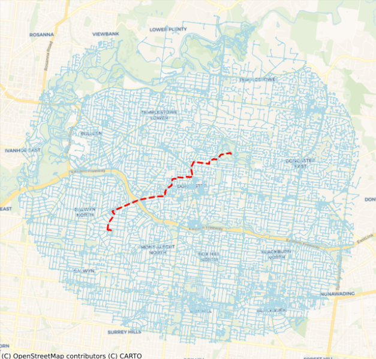
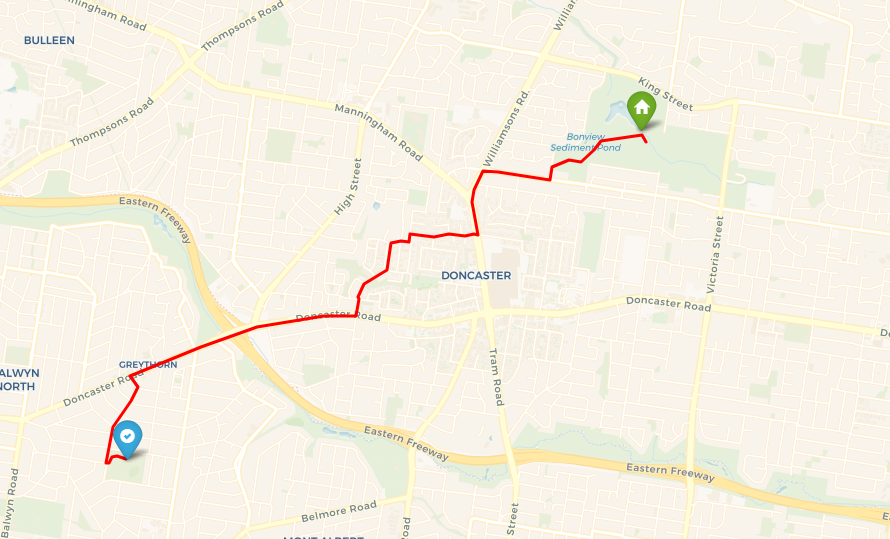

# Network Analysis and Map Generation with osmnx, contextily and folium

This project focuses on using the osmnx library to perform simple shortest route network analysis with openstreetmap data and visualise them on both static and interactive maps.

## Usage

File:
* shortest_route.ipynb

Software:
* Python 3.11 (older versions may work)

GIS libraries:
* shapely
* geopandas
* folium
* osmnx
* contextily

Once the file, software and library pre-requisites are established, run all the cells in the jupyter notebook. This will generate an interactive map in the form of an html file ***shortest_route.html***.

### Adjusting parameters

The following variables can be adjusted in *shortest_route.ipynb*.

```
PLACE_NAME = "Doncaster, Victoria, Australia"

tags = {'building':'sports_centre'}
distance = 5000

...

travel_type = 'bike'

...

origin_name = "Ruffey Lake Park, Victoria, Australia"
```

* PLACE_NAME: area of interest 
* tags: map feature elements as specified by openstreetmap 
* distance: specified distance radius to create zone of interest around PLACE_NAME
* travel_type: specified mode of travel
* origin_name: name of starting location within area of interest 

The above default parameters achieve the following:
* Consider all sports centres within 5km around doncaster
* Find the closest sports centres to ruffey lake park when travelling on a bike

## Map Visualisations
Static map with shortest path analysis: <br>


Interactive map with shortest path analysis: <br>


