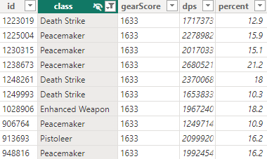
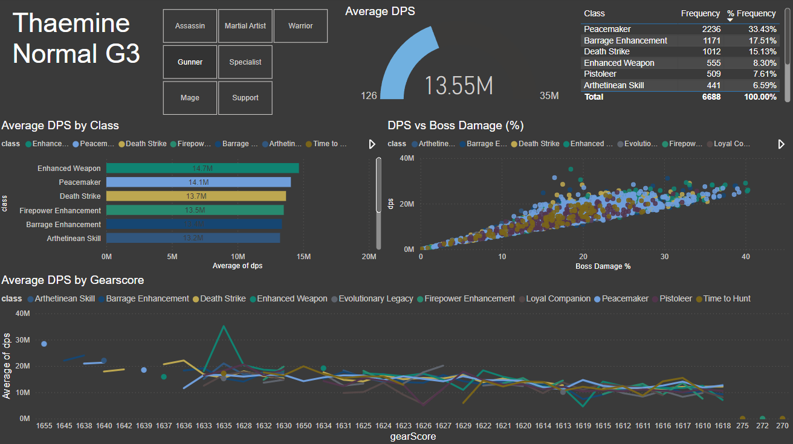
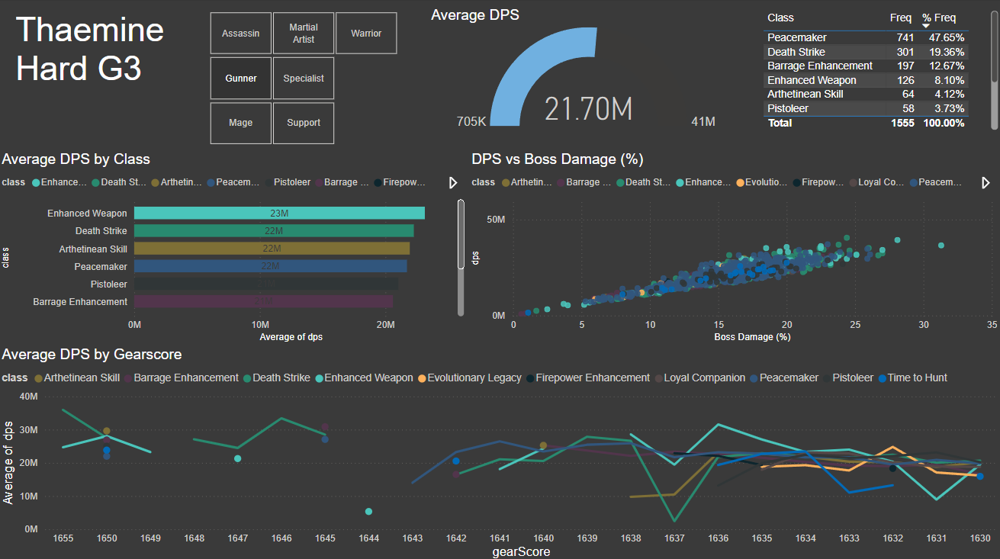

# PowerBI Dashboard for Lost Ark Raid Logs

Lost Ark is an action MMORPG developed by Smilegate RPG. A major component of the game involves 8 person raids, where players work together to defeat a boss. In particular, the 3rd gate of the Thaemine raid is one of interest, given its recency and relative difficulty. In addition, external applications were developed by players to track raid data and enabled players to upload their raid data logs for public use. 

This project uses specific Lost Ark raid data that is regularly scrapped from one of these external applications and can be found here: https://github.com/evilandrex/raided-loa-scraper/tree/main/data.

With the availability of raid data, this project showcases PowerBI for generating dashboards.

## Usage

Running the PowerBI dashboards requires the following:

Files
* Thaemine_G3_Hard.csv
* Thaemine_G3_Normal.csv
* loalogs_dashboard.pbix

Software:
* PowerBI Desktop Version: 2.130.754.0 64-bit (Older versions may work)

Once the files and software pre-requisites are established, the dashboard can be loaded by opening the loalogs_dashboard.pbix file in PowerBI Desktop.

## Lost Ark Raid Data

Here is a snapshot of the data set used in the dashboards.  

The dataset has the following properties:
* id: unique identifier for person who uploaded the raid data
* class: name of character type
* gearScore: an in-game value indicating a character's power from gear
* dps: the calculated damage per second in the raid
* percent: the percentage of damage dealt when compared to the damage of the 7 other raid members

## PowerBI Dashboard
Two dashboards were created to compare the performance of classes in Thaemine G3 for both normal and hard modes. 

Specifically, the dashboards contains the following features:
* Ability to filter on specific class types, such as 'Gunner'
* Highlights minimum, average and maximum DPS achieved
* Class popularity
* Assess how gearscore affects average DPS
* Compare DPS against boss damage % contribution

### Thaemine G3 Normal Dashboard

### Thaemine G3 Hard Dashboard

## Example Insights

Looking at the 'Gunner' classes:
* Peacemaker is the most popular Gunner class with top 5 average performance in both normal and hard modes
* Enhanced Weapon is not a top 3 Gunner class in popularity, but on average has the best performance in both normal and hard modes
* Whilst barrage is top 3 in popularity, its average performance ranks 5th and 6th for normal and hard modes. 

 The high difficulty of classes such as Enhanced Weapon indirectly explains its high performance. Given the high investment required to get a character to these raids, classes of higher difficulty are generally played by more skillful individuals and those that know the class extremely well. Overall this appears to indicate that player skill is a major factor in determining raid performance.
