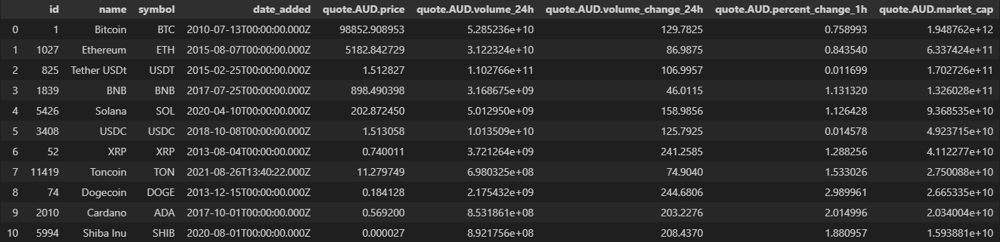

# Getting Crypto Data using an API in Python

This project focuses on using a public API from https://coinmarketcap.com to get crypto data and generate interactive visualisations. 


## Usage

Obtaining the crypto data requires the following:

Files
* crypto.py

Software:
* Python 3.11 (older versions may work)

Once the file and software pre-requisites are established, run the file *crypto.py*

```
python crypto.py
```

This will create a new csv file *crypto_data.csv* that contains the pulled crypto data from the API. If the *crypto_data.csv* file already exists, any data pulled from the API will append new data to the existing file.

### Adjusting parameters

The following variables can be adjusted in *crypto.py*.

```
API_KEY = '819e86e2-1a96-46fa-8b1b-410cac45b1f1'

currency = 'AUD'
data_limit = '15'
n_calls_daily = 20
call_interval = 60*5
```

* API_KEY: required key to access API. See https://pro.coinmarketcap.com/ to obtain a free API key
* data_limit: the maximum rows of data to pull in per API call
* n_calls_daily: the maximum number of API calls per run of Python script
* call_interval: frequency of API calls 

The above default parameters achieve the following:
* Make 20 API calls every 5 minutes where each API call gets 15 rows
* The value of coins in the data is expressed in Australian dollars

## Future development
A snapshot of the dataset is as follows: <br>


An interactive visualisation will be developed in the future with plotly to showcase data visualisations in Python.
