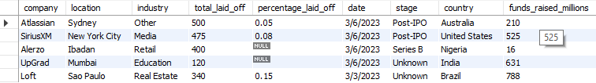
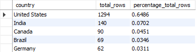
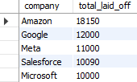
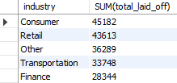
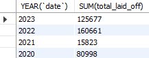
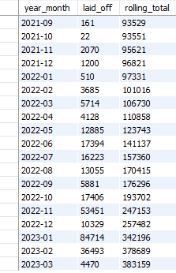
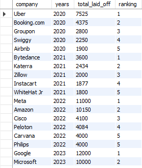
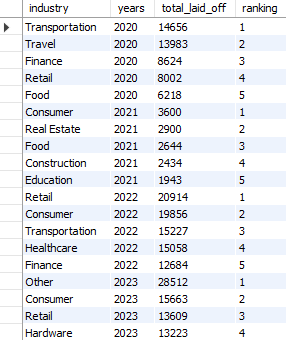

# Data Cleaning and Exploratory Data Analysis in SQL

This project uses a global layoffs data set taken from https://www.kaggle.com/datasets/swaptr/layoffs-2022.

The purpose of this project is to showcase the use of SQL for **data cleaning** and **exploratory data analysis (EDA)**

## Usage

Running the sql scripts requires the following:

Files
* layoffs.csv
* data_cleaning.sql
* exploratory_data_analysis.sql

Software:
* MySQL Server 8.0 (older versions may work)
* MySQL Workbench 8.0 CE (older versions may work)

Once the files and software pre-requisites are established, a new *schema* needs to be created to import the layoffs.csv data into a *layoffs* table. Then,

* To clean the global layoffs data set, run the ***data_cleaning.sql*** script
* To perform EDA, run the ***exploratory_data_analysis.sql*** script 

## Data Cleaning
The first 5 rows of the raw data are:  

The data set was largely clean, however small issues such as duplicates, white spaces, similar and missing values were identified.

Therefore, the sequence of data cleaning events were as follows:
1. Create a staging table to not mess with the original data
2. Remove duplicate rows by creating a second staging table and an added ROW_NUMBER column
3. Standardise values, including:
    * removing leading and trailing whitespaces
    * combining similar values in columns (e.g. Crypto, Crypto Currency, CryptoCurrency)
    * format date column from text to date type
4. fill in missing values where possible
5. remove added ROW_NUMBER column 

## Exploratory Data Analysis
Once the data was cleaned, an analysis was conducted and these were the findings:

* The dataset contained roughly 3 year's worth of layoffs data starting from March of 2020.  

* 65% of the layoffs data came from the United States.  

* At a specific point within the 3 year window, Google had the most layoffs, whilst Branch had the least layoffs.  

* Within the 3 year period, Amazon had the most layoffs, followed by Google and Meta.  

* The consumer industry experienced the most layoffs within the 3 year period.  

* There were considerably less layoffs in 2021 compared to other years. Even though only 3 months in 2023 were considered, by the end of the year, the total layoffs is likely to surpass even 2022. 

* There were a large number of layoffs just before the christmas period in 2022 and after the new year in 2023.  

* Uber had the most layoffs in 2020, whilst in subsequent years, the top layoffs were dominated by tech giants such as Meta, Amazon, Google and Microsoft.  

* The transportation and travel industry had the most layoffs in 2020, but in subsequent years, consumer and retail topped the charts. 
